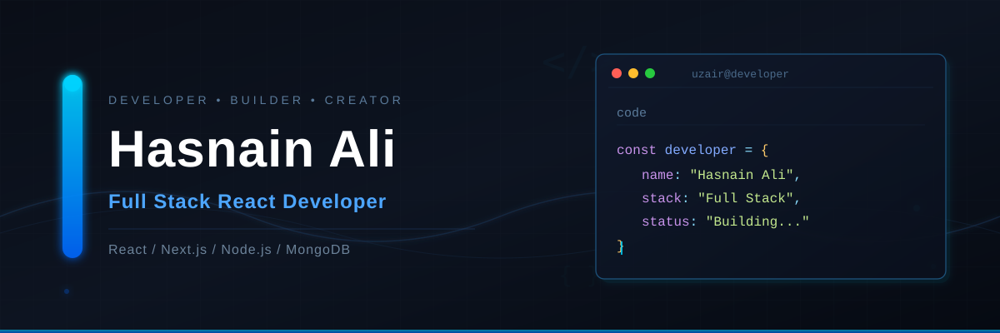

  

<h1 align="center">Hi, I'm Hasnain Ali 👋</h1>

<h3 align="center">Full-Stack React Developer 🚀</h3>

I build modern, responsive, and interactive web applications with a strong focus on clean UI, smooth animations, reusable components, and practical functionality.

My development journey started with **HTML and CSS** and progressed through **Tailwind CSS, JavaScript, React.js, Next.js, Node.js, Express.js, MongoDB, REST APIs, Git, and GitHub**.

I enjoy turning ideas into real-world applications — from creative websites and personal portfolios to dashboards, POS systems, business websites, and full-stack applications.

---

## 🚀 What I Build

- Full-stack web applications
- SaaS platforms
- Modern React applications
- Interactive & animated websites
- Business websites
- Admin dashboards
- POS & order management systems
- REST API based applications
- Responsive user interfaces

---

## 🛠 Tech Stack

### 👨‍💻 Languages

  

### ⚛️ Frontend Development

  

### 🎨 Animation & UI

  
  

### ⚙️ Backend Development

  

### 🗄️ Database

  

### 🧰 Tools & Platforms

  

### ☁️ Services

  

## 🚀 Featured Projects

### 💻 Personal Portfolio

Modern personal portfolio with interactive sections, responsive design, and smooth animations.

**React · Tailwind CSS · GSAP · Framer Motion · React Router**

---
